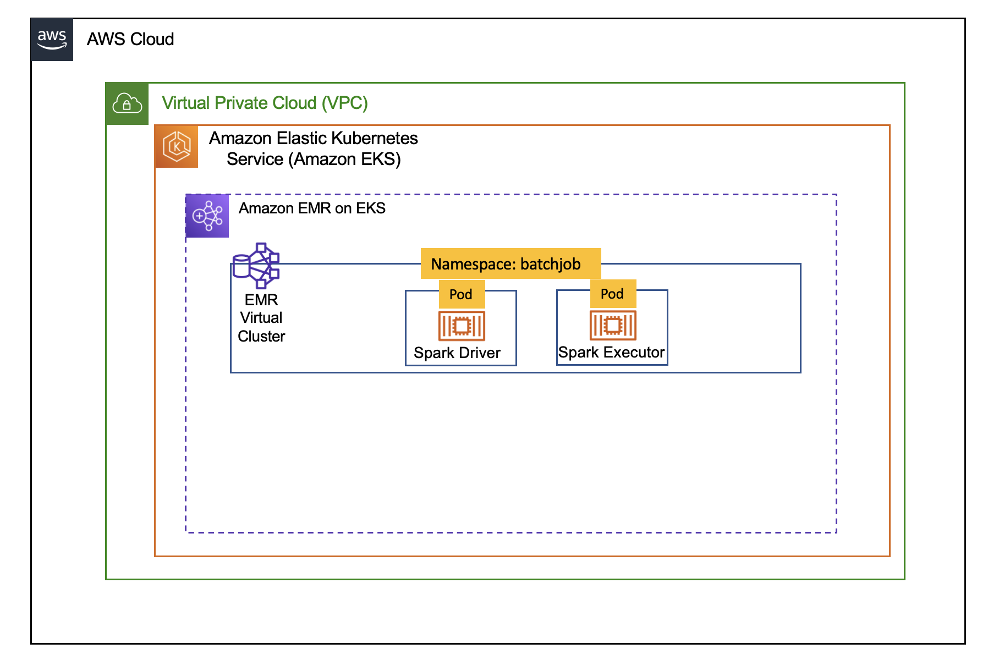

# EMR on EKS with CDK blueprint

## Introduction
In this post, we will learn how to use EMR on EKS AddOn and Teams in the `cdk-eks-blueprints` to deploy a an infrasturcture on EKS to submit Spark Job. The `cdk-eks-blueprints` allows you deploy an EKS cluster and enable it to be used by EMR on EKS service with minimal setup. The architecture below shows a conceptual view of the infrastructure you will deploy through this blueprint.



## Deploying the Solution

In this [example](https://github.com/awslabs/data-on-eks/tree/main/analytics/cdk/emr-eks), you will provision the following:

- Creates EKS Cluster Control plane with public endpoint (for demo purpose only)
- Two managed node groups
  - Core Node group with 3 AZs for running system critical pods. e.g., Cluster Autoscaler, CoreDNS, Logging etc.
  - Spark Node group with single AZ for running Spark jobs
- Enable EMR on EKS and create one Data teams (`emr-data-team-a`)
  - Creates new namespace for each team
  - Creates Kubernetes role and role binding(`emr-containers` user) for the above namespace
  - New IAM role for the team execution role
  - Update AWS_AUTH config map with  emr-containers user and AWSServiceRoleForAmazonEMRContainers role
  - Create a trust relationship between the job execution role and the identity of the EMR managed service account
- EMR Virtual Cluster for `emr-data-team-a`
- IAM policy for `emr-data-team-a`
- Deploys the following Kubernetes Add-ons
    - Managed Add-ons
        - VPC CNI, CoreDNS, KubeProxy, AWS EBS CSi Driver
    - Self Managed Add-ons
        - Metrics server with HA, Cluster Autoscaler, CertManager and AwsLoadBalancerController

This blueprint can also take an EKS cluster that you defined using the `cdk-blueprints-library`.

### Prerequisites

Ensure that you have installed the following tools on your machine.

1. [aws cli](https://docs.aws.amazon.com/cli/latest/userguide/install-cliv2.html)
2. [kubectl](https://Kubernetes.io/docs/tasks/tools/)
3. [CDK](https://docs.aws.amazon.com/cdk/v2/guide/getting_started.html#getting_started_install)

**NOTE:** You need to have an AWS account and region that are [bootstrapped](https://docs.aws.amazon.com/cdk/v2/guide/getting_started.html#getting_started_bootstrap) by AWS CDK.

### Customize

The the entry point for this cdk blueprint is `/bin/emr-eks.ts` which instantiate a stack defined in `lib/emr-eks-blueprint-stack.ts`. This stack must be provided with a VPC and a list of EMR on EKS team definition and the role that will be admin of the EKS cluster. It can also take as options an EKS cluster defined through `cdk-blueprints-library` and the EKS cluster name.

The properties that are passed to the emr on eks blueprint stack are defined as such:

```typescript
export interface EmrEksBlueprintProps extends StackProps {
  clusterVpc: IVpc,
  clusterAdminRoleArn: ArnPrincipal
  dataTeams: EmrEksTeamProps[],
  eksClusterName?: string, //Default eksBlueprintCluster
  eksCluster?: GenericClusterProvider,

}
```

In this example we define a VPC in `lib/vpc.ts` and is instantiated in `bin/emr-eks.ts`. We also define a team called `emr-data-team-a` and which has an execution role called `myBlueprintExecRole`.
The blueprint will deploy by default an EKS cluster with the managed nodegroups defined in the section [Deploying the Solution](#deploying-the-solution).

### Deploy

Before you run the solution, you **MUST** change the `clusterAdminRoleArn` of the `props` object in `lib/emr-eks.ts`. This role allows you to interact manage EKS cluster and should have be allowed at least the IAM action `eks:AccessKubernetesApi`.

Clone the repository

```bash
git clone https://github.com/awslabs/data-on-eks.git
```

Navigate into one of the example directories and run `cdk synth`

```bash
cd analytics/cdk/emr-eks
npm install
cdk synth --profile YOUR-AWS-PROFILE
```

Deploy the pattern

```bash
cdk deploy --all
```

Enter `yes` to deploy.

## Verify the resources

Let’s verify the resources created by `cdk deploy`.

Verify the Amazon EKS Cluster

```bash
aws eks describe-cluster --name eksBlueprintCluster # Update the name cluster name if you supplied your own

```

Verify EMR on EKS Namespaces `batchjob` and Pod status for `Metrics Server` and `Cluster Autoscaler`.

```bash
aws eks --region <ENTER_YOUR_REGION> update-kubeconfig --name eksBlueprintCluster # Creates k8s config file to authenticate with EKS Cluster. Update the name cluster name if you supplied your own

kubectl get nodes # Output shows the EKS Managed Node group nodes

kubectl get ns | grep batchjob # Output shows batchjob

kubectl get pods --namespace=kube-system | grep  metrics-server # Output shows Metric Server pod

kubectl get pods --namespace=kube-system | grep  cluster-autoscaler # Output shows Cluster Autoscaler pod
```

## Execute Sample Spark job on EMR Virtual Cluster
Execute the Spark job using the below shell script.

- Once you deploy the blueprint you will have as output the Virtual Cluster id. You can use the id and the execution role for which you supplied a policy to submit jobs. Below you can find an example of a job you can submit with AWS CLI.

```bash

export EMR_ROLE_ARN=arn:aws:iam::<YOUR-ACCOUNT-ID>:role/myBlueprintExecRole

aws emr-containers start-job-run \
  --virtual-cluster-id=<VIRTUAL-CLUSTER-ID-IN-CDK-OUTPUT> \
  --name=pi-2 \
  --execution-role-arn=$EMR_ROLE_ARN \
  --release-label=emr-6.8.0-latest \
  --job-driver='{
    "sparkSubmitJobDriver": {
      "entryPoint": "local:///usr/lib/spark/examples/src/main/python/pi.py",
      "sparkSubmitParameters": "--conf spark.executor.instances=1 --conf spark.executor.memory=2G --conf spark.executor.cores=1 --conf spark.driver.cores=1 --conf spark.kubernetes.node.selector.app=spark"
    }
  }'

```

Verify the job execution

```bash
kubectl get pods --namespace=batchjob -w
```

## Cleanup

To clean up your environment, you call the command below. This will destroy the Kubernetes Add-ons, EKS cluster with Node groups and VPC

```bash
cdk destroy --all
```

:::caution

To avoid unwanted charges to your AWS account, delete all the AWS resources created during this deployment
:::
